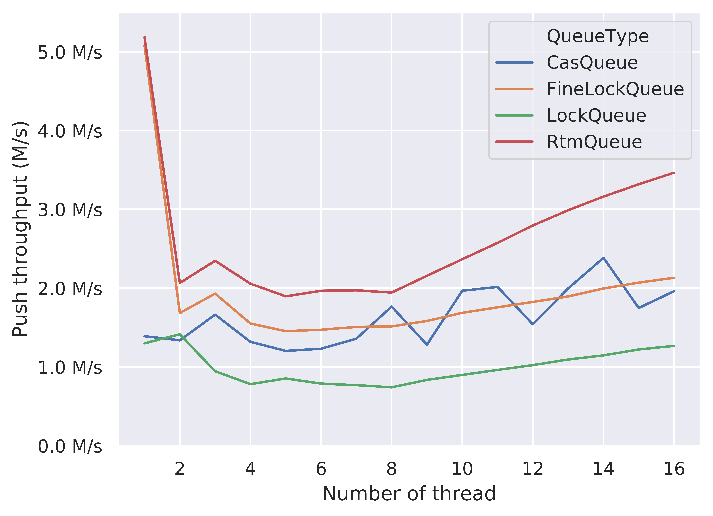
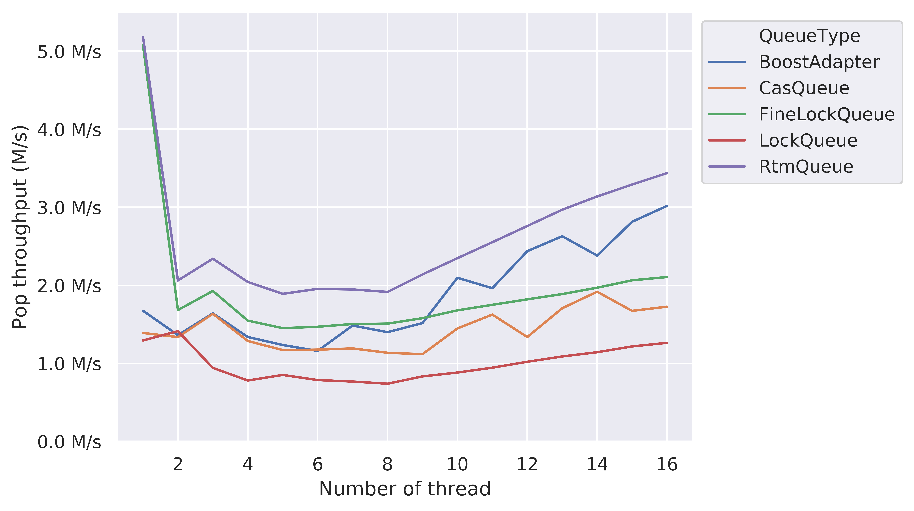

Project URL: [`https://flowersh0026.github.io/618-final/`](https://flowersh0026.github.io/618-final/)

# Summary


# Background


# Approach


# Results

## Effects on Optimization Techniques

```{=latex}
 \begin{figure}[H]
    \begin{subfigure}{0.5\textwidth}
        \includegraphics[width=\textwidth]{../result/opt_RtmQueue_push_rate.png}
        \caption{RtmQueue Push}
        \vspace{1em}
    \end{subfigure}
    \begin{subfigure}{0.5\textwidth}
        \includegraphics[width=\textwidth]{../result/opt_CasQueue_push_rate.png}
        \caption{CasQueue Push}
        \vspace{1em}
    \end{subfigure}

    \begin{subfigure}{0.5\textwidth}
        \includegraphics[width=\textwidth]{../result/opt_RtmQueue_pop_rate.png}
        \caption{RtmQueue Pop}
    \end{subfigure}
    \begin{subfigure}{0.5\textwidth}
        \includegraphics[width=\textwidth]{../result/opt_CasQueue_pop_rate.png}
        \caption{CasQueue Pop}
    \end{subfigure}

    \caption{Effects on different optimization techniques (jemalloc and cache line alignment).}
\end{figure}
 ```

## Performance comparison

<!-- You can replace the markdown-style image insertion by the latex-style
image insertion, which allows using {figure}[H]. -->





# References

[1] Maged M. Michael and Michael L. Scott. 1996. Simple, fast, and practical
non-blocking and blocking concurrent queue algorithms. In Proceedings of the
fifteenth annual ACM symposium on Principles of distributed computing (PODC
'96). ACM, New York, NY, USA, 267-275.

<!-- TODO: a final section is required to be included in the final report. -->
