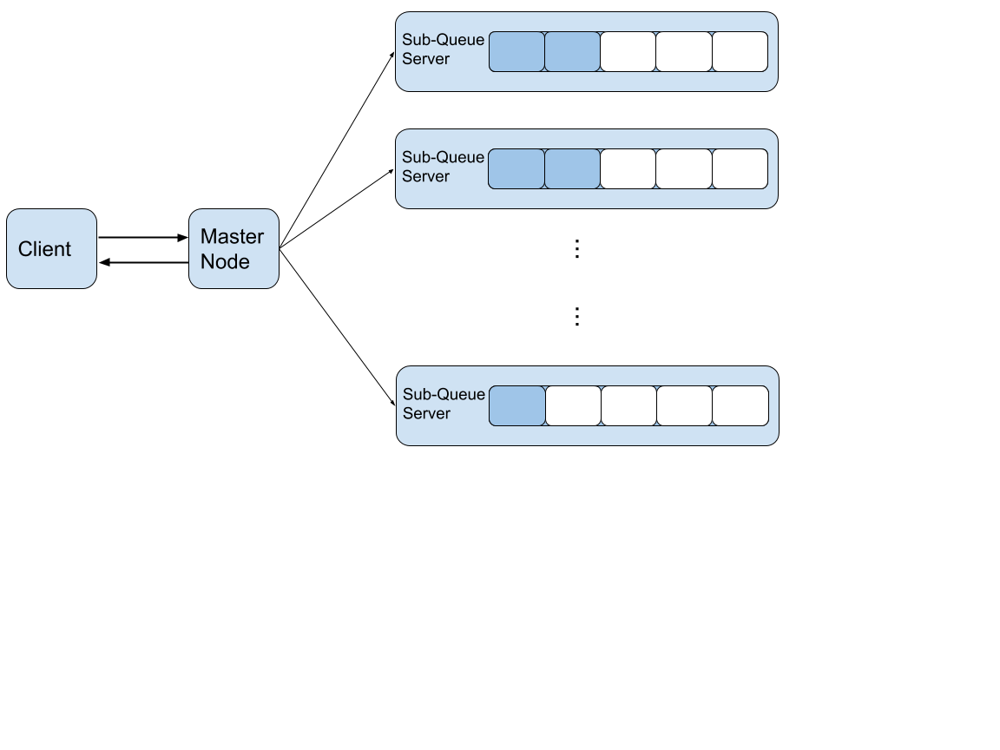
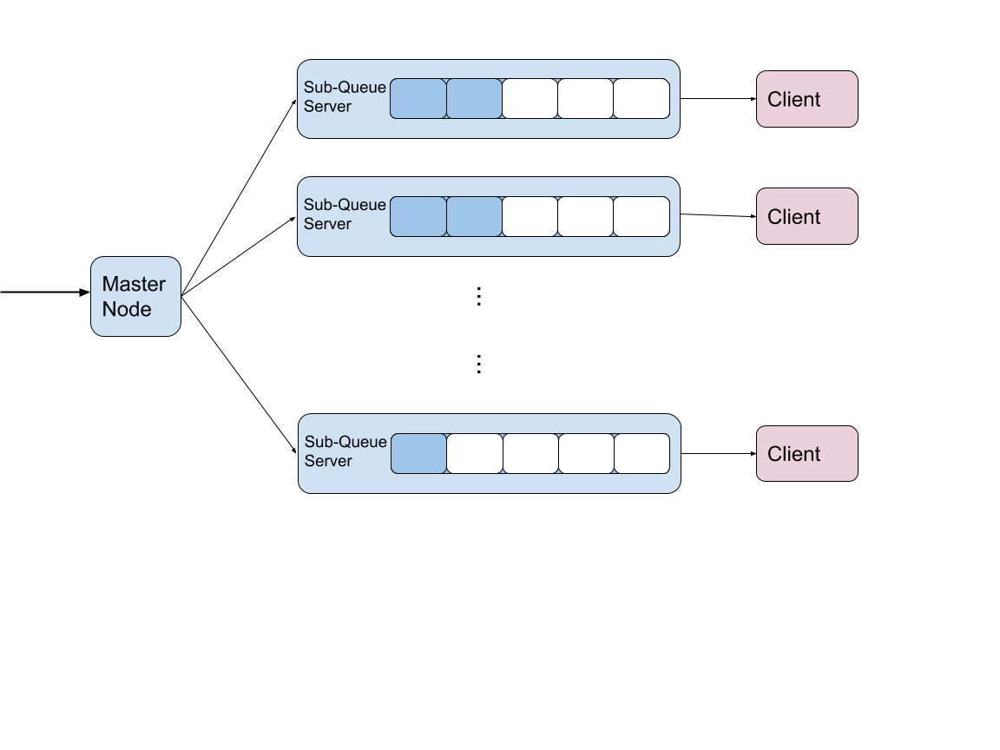
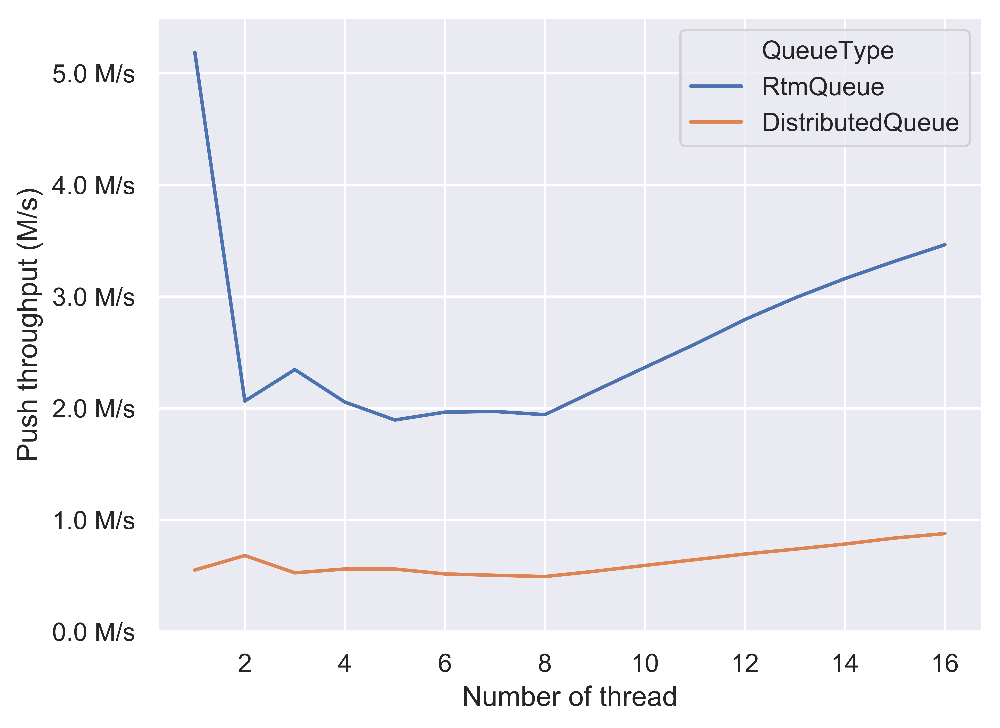
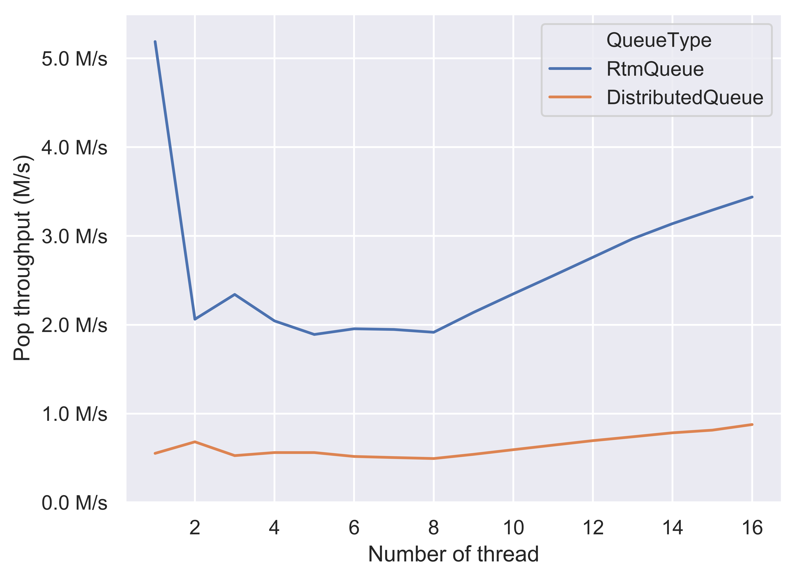

Project URL: [`https://flowersh0026.github.io/618-final/`](https://flowersh0026.github.io/618-final/)

# Summary

We implemented four versions of concurrent dynamic sized FIFO queue including
coarse-grained lock version, fine-grained lock version, lock-free (CAS-based)
version and transactional memory (RTM-based) version, compared the performance
of the four implementations and analyzed the results. We further studied possible
designs of distributed queue, implemented a simple version locally and compared
its performance with centralized version.

# Background

Dynamic sized queue is a commonly used basic data structure. A concurrent multiple
producer multiple consumer queue can be useful in many parallel scenarios.
There are three base operations for a FIFO queue including push, pop and front.
All of the base operations can be done in O(1). Push and pop would modify the
queue by inserting/removing elements to/from tail/head, while top will only do
a read operation on the head.

As a concurrent data structure, the most computationally expensive part is the
synchronization on the key variables, for example, ensuring the head and tail
pointers are correct. Besides the updates on these key variables, other
operations can be parallelized across the threads that use the concurrent
queue. Thus, the efficiency on these synchronization is important to improve
the overall performance of the concurrent queue under the multi-threaded
environment.

In this project, we studied how different methods of synchronization influence
the performance of a concurrent dynamic sized queue. We only studied the push
and pop operations, because the top operation is relatively trivial and does not
impose challenge on synchronization. We tested the correctness on push and pop
operations and benchmarked the throughput (items per second) on push and pop
operations. The details of test and benchmark will be described further in the
results section.

In addition to a centralized queue, under scenarios that the queue needs to
serve large amount of works, distributed queue could help a lot when single
machine could not hold all the data. We explored possible designs (structures)
of a distributed queue as an extension to centralized queue.

# Approach

## Technologies

We mainly use the GHC machines as our development platform, and we use C++ as
the main programming language. C++ provides good zero-cost abstractions that
allow us to implement complicated data structures with less efforts, and it also
gives us full control on the platform and runtime.

## Parallization

The concurrent queue structure is inherently closely related to parallization.
Both our tests and benchmarks are building on a Multiple Producer Multiple
Consumer (MPMC) framework that we set up, which parallized to perform push and
pop operations on the queue. The benchmark library we used will spawn threads
and the spawned threads will perform the task of pushing or poping as we assigned.
Further details of how experiments are set up could be found in results section
below.

## Algorithms

We implement 4 versions of concurrent queues, including lock-free CAS-based
queue (`CasQueue`), lock-free queue (`RtmQueue`) using Intel TSX's Restricted
Transactional Memory (RTM), and coarse-grained (`LockQueue`) and fine-grained
(`FineLockQueue`) lock queue. The coarse-grained queue simply uses a global
mutex to protect the member variables. The fine-grained lock queue uses the
two-lock algorithm described in [1], and the RTM-based queue extends from the
fine-grained lock version with an additional optimistic path using
transactional memory. The algorithm for CAS-based queue is from [1]. To handle
the ABA problem, we use tagged pointer with double-word compare-and-swap (CAS)
provided by libatomic (gcc). Also, to achieve memory safety, we implement a
lock-free stack as the free list, and wrap it to be a memory allocator that is
used for memory allocation and reclamation in the CAS-based queue.

## Optimization Steps

We started with simple initial version of implementations. After benchmarking
and analyzing the performance of initial implementations, we try to optimize
the implementation in two aspects including using a better memory allocator
(jemalloc [3]) and conducing cache line alignment on variables to avoid false
sharing. We did comparisons on these two optimization approaches and confirmed
that they can improve the performance. Then we applied them in all concurrent
queues we've implemented, and conducted our experiments based on the fully
optimized versions.  The details and the analysis of the optimization methods
are included in the result section below.

# Results

## Performance Metric and Experimental Setup

We use Google Benchmark library [2] to do the performance measurement. Since
the accurate wall-clock time measurement in Google Benchmark requires disabling
the CPU frequency scaling, we use the average CPU time for a single thread as
an estimate of the wall-clock time. The metric we use for performance
comparison is the push and pop operation throughput, which is defined as the
number of items being pushed or popped in a second.

We set up the experiments using a Multiple Producer Multiple Consumer (MPMC)
framework. In each experiment, we create equal number of producer and consumer
threads to repeatedly do the push and pop operations. The number of producer
threads is from 1 to 16, and the number of consumer threads is also from 1
to 16. The number of iterations is determined by the Google benchmark library
(i.e., the size of inputs, typically varying from 100,000 to 7,000,000). When
the benchmark is running, the producer and consumer threads continuously push
and pop items to and from the shared concurrent queue. They counts the number
of pushed items and popped items separately. On tear-down, it reports the sum
of the number of items pushed and items popped, and we will use these two
numbers to calculate the push throughput and pop throughput in this benchmark
case. A typical number of pushed and popped items varies from 50,000 to
3,000,000 in our results.

The problem size of our benchmark is the number of concurrent threads, rather
than the number of items being pushed and popped. This is because the number of
concurrent threads reflects the level of contentions, which is an important
factor when benchmarking the performance of a concurrent data structure. Thus,
in all results shown below, we use the number of concurrent threads as the x
axis. Since the machines we are targeting (the GHC cluster machines,
ghcX.ghc.andrew.cmu.edu) have 16-core CPUs, we will run at most 32 threads
(considering Intel's hyper-threading) in each benchmark case, which means that
we run at most 16 producer threads and 16 consumer threads at the same time.

## Effects of Optimization Techniques

We first compare the effects of two different optimization techniques in our
implemented concurrent queues, including using a better memory allocator
(jemalloc [3]) and conducing cache line alignment on variables to avoid false
sharing. We mainly focus on the results of RTM-based queue and CAS-based queue
here. In the figures, "None (baseline)" version is the baseline version, which
uses none of these two optimization techniques. "jemalloc" version is the
version using the jemalloc memory allocator. "Aligned" version is the version
that aligns all internal variables of the concurrent queues to the cache line.
Finally, the "jemalloc & Aligned" version is the version uses both jemalloc and
cache line alignment.

### Push Throughput of RtmQueue

First, we shows the comparison of push throughput on RTM-based queue when applying
different combinations of optimizations.

We first look at the low-contention region (thread = 1). From the figure, we
know that using jemalloc is able to significantly improve the performance of
both non-aligned and aligned version. In this scenario, the contention only
comes from the consumer when checking an empty queue, if variables are aligned
to the cache line, since both producer and consumer will access the same dummy
node when the queue is empty. Also, because the producer roughly does nothing
between two push operations, the memory allocation may takes non-negligible
portions of time. Therefore, using a better memory allocator is able to improve
the performance in this scenario.

Cache line alignment brings higher improvement in this low-contention region.
From this figure, the "Aligned" version is higher than the "jemalloc" version,
showing that this optimization technique has a higher speedup compared with
using a better memory allocator. By aligning the variables within the data
structure to the cache line (basically the head and tail pointer), it greatly
reduces the false sharing between the producer and consumer threads, so
significantly improves the performance.

In the high-contention region (thread = 16), the effects are roughly the same,
except that the "jemalloc" version performs worse than the baseline
non-optimized version. We believe that this is due to the performance variance
when false sharing exists. The consistent improvement of the "jemalloc &
Aligned" version compared with the "Aligned" version in the region from thread
= 5 to thread 16 partially illustrates our explanation.

### Pop Throughput of RtmQueue

The effects of optimizations on the pop throughput of RTM-based queue are
similar. The "jemalloc & Aligned" version uniformly outperforms other poorly
optimized versions. However, from the figure, the "Aligned" version performs
worse than the baseline version when thread = 1, which is possibly due to the
high variance nature of microbenchmark.

### Push Throughput of CasQueue

Similarly, the "jemalloc & Aligned" version of the CAS-based queue generally
outperforms other versions across the whole x axis. However, the performance
improvement is not stable and it does not perform better when thread = 1. We
believe that this is due to the fact that the CAS version uses more memory
access than others in its lock-free algorithm, which possibly creates more
chances of memory contention and cache coherence traffics, resulting in a
higher variance in performance. Also, the performance gain of these two
optimizations in CAS-based queue is less than the one we obtain in the
RTM-based queue.

### Pop Throughput of CasQueue

We can observe an overall better performance of the "jemalloc & Aligned"
version. However, similar to the push throughput result of CAS-based queue, the
performance gain is not quite significant. Though the pop operation in the
CAS-based queue only requires one CAS operation when fetching the head node, it
also needs to fix the tail pointer position during this operation, and runs a
while loop inside the lock-free memory deallocation. In contrast, the push
operation merely access the tail pointer. In addition, we only count the
succeeded pop, so the failed pop on the empty queue also lowers the overall pop
throughput of the CAS-based queue.

### Summary on Optimizations

After benchmarking the effects, we are convinced that applying these
optimization techniques does improve the performance of concurrent queues.
Hence, we apply them in all our implemented concurrent queues, and the results
shown below all use the "jemalloc & Aligned" version.

## Performance comparison

After exploring the best optimizations, we compare the performance metric
between all our implemented concurrent queues, including two locked versions
(coarse-grained and fined-grained versions). We separately compare the push
throughput and pop throughput.

### Push Throughput Comparison

In the low-contention region (thread = 1), RTM-based queue and fine-grained
lock queue greatly outperforms other two versions. Because the fine-grained
versions separate the mutex for head and tail pointers (also properly aligned),
the producer thread is less likely to be affected by the consumer thread. In
contrast, the coarse-grained queue takes the global mutex for both head and
tail pointers, which creates contention between the producer and the consumer.

The RTM-based queue is basically evolved from the fine-grained lock queue, by
adding an optimistic path using transactional memory. Therefore, under the
low-contention scenario, it uses the optimistic path in most cases. From here
we can also see that the mutex performance is pretty well when the contention
is low. For the CAS-based queue, its lock-free algorithm has a higher constant
factor, which probably negatively affects its performance in low-contention
region.

In the high-contention region (thread > 8), RTM-based queue significantly
outperforms all other versions, which means that the optimistic path using the
transactional memory has a high success rate, because the fallback alternative
path of RTM-based queue requires two extra memory-synchronized atomic
operations, which leads to a higher constant factor compared with the
fine-grained lock version. The performance of CAS-based queue is not stable,
which may be the result of high contention. The fine-grained lock queue shows a
similar performance compared with CAS-based queue. Finally, the coarse-grained
lock version undoubtedly shows the worst throughput performance.

An interesting fact from this figure is that the absolute throughput for
RTM-based queue and fine-grained lock queue in thread = 1 greatly outperforms
the throughput in thread = 16. However, from thread = 2 to thread = 16, we
indeed observe the performance improvement as the number of threads increases.
We guess that the low-contention scenario greatly reduces the cache coherence
traffics, leading to a faster memory access and finally the overall better
throughput. From thread = 1 to 2, the cache coherence traffics increase and the
memory access is no longer cheap. So, we observe a rapid drop from thread = 1
to 2. This result also help explain why people use two different designs for
MPMC and Single Producer Single Consumer (SPSC) scenarios, for example, boost
[4] and folly [5].

### Pop Throughput Comparison

The performance comparison on pop throughput is quite similar to the result of
push throughput. When thread = 1, both RTM-based queue and fine-grained lock
queue significantly outperforms other two implementations. As the number of
threads increases from thread = 2, the pop throughput increases. And finally,
when thread = 16, the RTM-based queue greatly outperforms other queues
including the fine-grained lock version. Therefore, from these two figures, we
conclude that the optimistic path in the RTM-based queue greatly improve the
overall performance. However, the machine dependency of RTM (requires Intel
TSX) probably limits its applications, especially in the era of cloud
computing.

### Analysis and Deeper Analysis

One of the factor that limits the speedup of our concurrent queues is the cache
coherence overhead (synchronization). Thus, we did the cache line alignment
which reduces the false sharing and improves the overall performance. The great
improvement of cache line alignment demonstrates our hypothesis that the
synchronization is one of the limiting factor. Another factor that limits the
speedup of our concurrent queues is the memory allocation. Through the
experiment that compares the performance with and without jemalloc shown above,
we observe performance improvement while using a better memory allocator. This
shows that our hypothesis about the memory allocation is also correct.
Currently we merely use the jemalloc for memory allocation. We believe a
well-design fixed-size memory pool with thread-local cache can outperform
jemalloc (designed for general variable-length allocation) in our
implementation. However, due to the limited time, we don't include it in our
project.

Execution time breakdown is difficult when handling the code that is sensitive
to the cache coherence traffics. The average time for each operation varies
from 100 ns to 1000 ns, which means that extra time measurement code inside the
operation likely changes the numbers a lot. In addition, the succeed rate of
the optimistic path in the transactional memory may change after inserting
extra code for the time measurement. Hence, we don't try to breakdown the push
and pop operations. However, from the analysis above, we think that we can try
implementing a fixed-size memory pool to further improve the performance.

## Distributed Extension

Beyond the study of synchronization on a FIFO queue on a single machine, we
extended the project to further explore queue on distributed systems. Throughout
our study, we mainly learnt about two possible structures as shown below.

The first one, shown in Figure 1, has the client contacted to the centralized
server, which controls the whole distributed set of queues as well as load
balancing. The other one is more distributed as shown in Figure 2. Although the
centralized server will still controls the load balancing of all sub queues and
be responsible for push, each client will pop out from a sub server it connected
to. Due to time limitation, we only designed the interface and completed a
localized version implementation for the first structure. A lock is used in the
centralized server for synchronization. Each sub-queue server maintains an
RTM-based queue.

Since we implemented it locally and the queue is eventually running on a single
machine instead of a real distributed system, we evaluate our implementation on
the extra contention added by the centralized server and the load balancing. The
load balancing policy we used is simply Round Robin because there is no network
load variance in the test. The benchmark framework used in this section is
identical to the one mentioned above. Since a RTM-based queue is used in each
sub-queue server, we compared the benchmark result of distributed queue with
the benchmark result of RTM-based queue. The comparison is shown below.

For both push and pop performance, in the low-contention region (thread = 1),
since we used a coarse-grained lock in the centralized server, the distributed
queue does not outperform as RTM-based queue does. The trending shape of
distributed queue is indeed similar to that of coarsed-grained lock queue. To
further improve (i.e. decrease contention cost), a fine-grained lock or a lock-
free design should be used in the centralized server. Nevertheless, more or less,
the centralized server would bring in an additional synchronization cost which
could not be avoided.

However, for a distributed queue run a real distributed system over network, we
believe that the network communication costs are likely to overweight the
synchronization cost on each single server.

# References

[1] Maged M. Michael and Michael L. Scott. 1996. Simple, fast, and practical
non-blocking and blocking concurrent queue algorithms. In Proceedings of the
fifteenth annual ACM symposium on Principles of distributed computing (PODC
'96). ACM, New York, NY, USA, 267-275.

[2] Google Benchmark library. https://github.com/google/benchmark/

[3] jemalloc. http://jemalloc.net/

[4] Boost C++ Libraries. https://www.boost.org/

[5] Folly: Facebook Open-source Library. https://github.com/facebook/folly/

# List of Work by Students

List of Jiaan's work:

1. RTM-based queue
2. Fine-grained lock queue
3. Unit test for correctness
4. Optimization and analysis
5. Tagged pointer and double-word CAS wrapper
6. Lock-free memory allocator (lock-free stack) for CAS-based queue
7. Checkpoint report
8. Proposal (cooperate)
9. Benchmark and analysis (cooperate)
10. Final report (cooperate)
11. Poster (cooperate)

List of Yunjia's work:

1. Coarse-grained lock queue
2. Intial implementation of lock-free (CAS-based) queue
3. Benchmark design and analysis (cooperate)
4. Distributed queue structure study and design (cooperate)
5. Distributed queue implementation
6. Proposal writeup (cooperate)
7. Final report writeup (cooperate)
8. Poster (cooperate)

Distribution of total credit:

60% (Jiaan) -- 40% (Yunjia)

