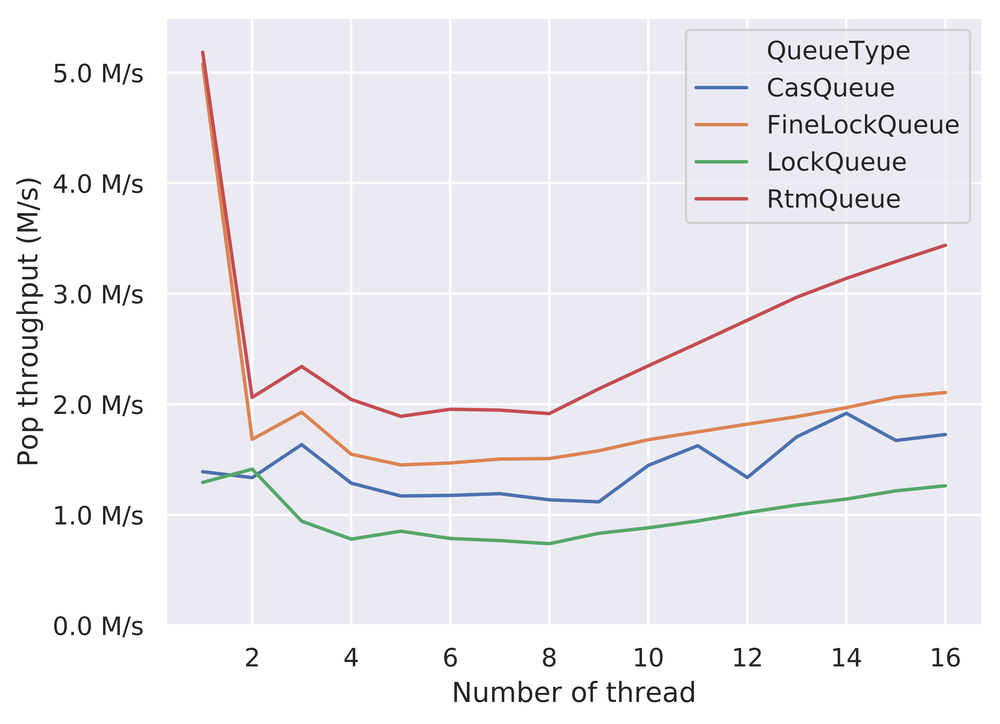

Project URL: [`https://flowersh0026.github.io/618-final/`](https://flowersh0026.github.io/618-final/)

# Summary

# Background

# Approach

# Results

## Performance Metric and Experimental Setup

We use Google Benchmark library [2] to do the performance measurement. Since
the accurate wall-clock time measurement in Google Benchmark requires disabling
the CPU frequency scaling, we use the average CPU time for a single thread as
an estimate of the wall-clock time. The metric we use for performance
comparison is the push and pop operation throughput, which is defined as the
number of items being pushed or popped in a second.

We set up the experiments using a Multiple Producer Multiple Consumer (MPMC)
framework. In each experiment, we create equal number of producer and consumer
threads to repeatedly do the push and pop operations. The number of producer
threads is from 1 to 16, and the number of consumer threads is also from 1
to 16. The number of iterations is determined by the Google benchmark library
(i.e., the size of inputs, typically varying from 100,000 to 7,000,000). When
the benchmark is running, the producer and consumer threads continuously push
and pop items to and from the shared concurrent queue. They counts the number
of pushed items and popped items separately. On tear-down, it reports the sum
of the number of items pushed and items popped, and we will use these two
numbers to calculate the push throughput and pop throughput in this benchmark
case. A typical number of pushed and popped items varies from 50,000 to
3,000,000 in our results.

The problem size of our benchmark is the number of concurrent threads, rather
than the number of items being pushed and popped. This is because the number of
concurrent threads reflects the level of contentions, which is an important
factor when benchmarking the performance of a concurrent data structure. Thus,
in all results shown below, we use the number of concurrent threads as the x
axis. Since the machines we are targeting (the GHC cluster machines,
ghcX.ghc.andrew.cmu.edu) have 16-core CPUs, we will run at most 32 threads
(considering Intel's hyper-threading) in each benchmark case, which means that
we run at most 16 producer threads and 16 consumer threads at the same time.

## Effects of Optimization Techniques

We first compare the effects of two different optimization techniques in our
implemented concurrent queues, including using a better memory allocator
(jemalloc [3]) and conducing cache line alignment on variables to avoid false
sharing. We mainly focus on the results of RTM-based queue and CAS-based queue
here.

### Push Throughput of RtmQueue

First, we shows the comparison of push throughput on RTM-based queue when applying
different combinations of optimizations.

We first look at the low-contention region (thread = 1). From the figure, we
know that using jemalloc is able to significantly improve the performance of
both non-aligend and aligned version. In this scenario, the contention only
comes from the consumer when checking an empty queue, if variables are aligned
to the cache line, since both producer and consumer will access the same dummy
node when the queue is empty. Also, because the producer roughly does nothing
between two push operations, the memory allocation may takes non-negligible
portions of time. Therefore, using a better memory allocator is able to improve
the performance in this scenario.

Cache line alignment brings higher improvement in this low-contention region.
From this figure, the "Aligned" version is higher than the "jemalloc" version,
showing that this optimization technique has a higher speedup compared with
using a better memory allocator. By aligning the variables within the data
structure to the cache line (basically the head and tail pointer), it greatly
reduces the false sharing between the producer and consumer threads, so
significantly improves the performance.

In the high-contention region (thread = 16), the effects are roughly the same,
except that the "jemalloc" version performs worse than the baseline
non-optimized version. We believe that this is due to the performance variance
when false sharing exists. The consistent improvement of the "jemalloc &
Aligned" version compared with the "Aligned" version in the region from thread
= 5 to thread 16 partially illustrates our explanation.

### Pop Throughput of RtmQueue

The effects of optimizations on the pop throughput of RTM-based queue are
similar. The "jemalloc & Aligned" version uniformly outperforms other poorly
optimized versions. However, from the figure, the "Aligned" version performs
worse than the baseline version when thread = 1, which is possibly due to the
high variance nature of microbenchmark.

### Push Throughput of CasQueue

### Pop Throughput of CasQueue

## Performance comparison

### Push Throughput Comparison

### Pop Throughput Comparison

# References

[1] Maged M. Michael and Michael L. Scott. 1996. Simple, fast, and practical
non-blocking and blocking concurrent queue algorithms. In Proceedings of the
fifteenth annual ACM symposium on Principles of distributed computing (PODC
'96). ACM, New York, NY, USA, 267-275.

[2] Google Benchmark library. https://github.com/google/benchmark/

[3] jemalloc. http://jemalloc.net/

<!-- TODO: a final section is required to be included in the final report. -->
